### Fab Challenge 2
# Design Dialogues
For this challenge Didac and I teamed up to explore sensorial design, prosthetic-based fabrication and electronic sensing.

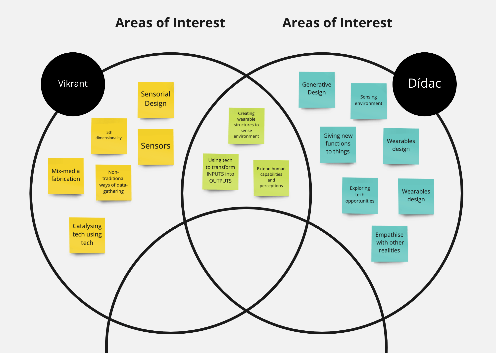
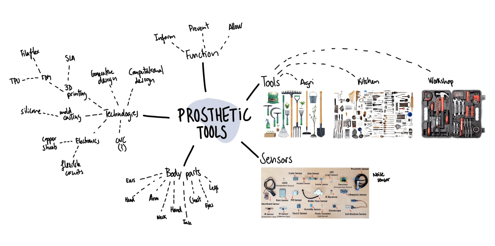
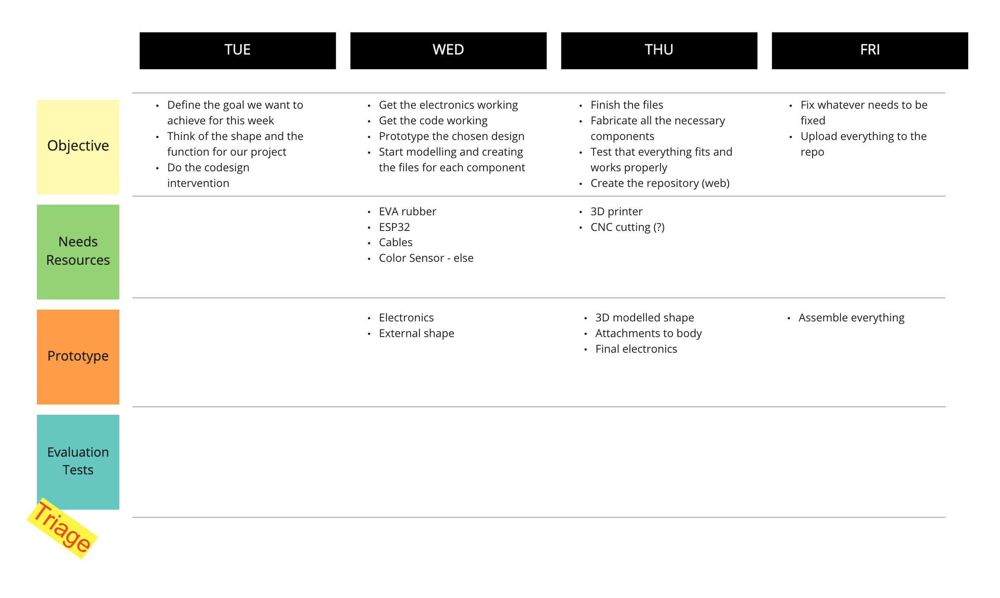

## Extended Organelles
The project started out of curiosity towards combining prosthetics, experimental fabrication and ways of  developing tools. The ideas explore how addition or elimination of senses could change the experience and trajectory of our daily lives. As the name might suggest, these prototypes are simple (yet digitally complex) extensions to our everyday body parts.

The basic points of curiosity revolved around making different electronic components and systems communicate with each other using sensors. Sensors were used to derive inputs from objects that don't radiate extractable digital data normally. The research simply aims at exploring and extending possibilities that the human body offers as a tool.

## Extended Meetup
A wearable and co-designing session was organized to imagine, sketch and prototype wearables based on groups and trigger cards. The trigger cards were divided in 3 categories of age group, type of sensor and random trigger. 

Certain wearables using the materials made available were made. The event consisted of a 15 min prototyping session and a ramp walk to demonstrate the usage and wearability. Since it was a co-design session, we participated in the experiment and brainstormed with participants, while sharing knowledge and inspirations. 

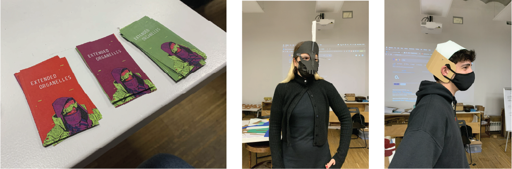

## Ideation
The ideation mainly involved exploring:

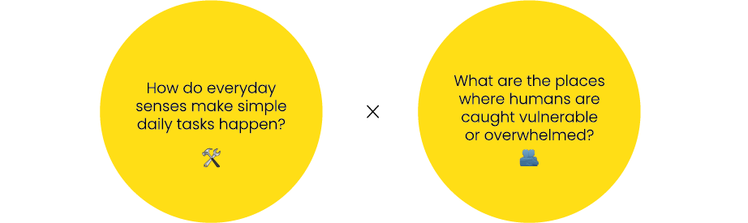

1. The idea explored how a color might sound/sing. The aim was to add a fifth dimension to the Design dialogues event using sound as a medium.
2. The idea explored how a device could help achieve Digital Solitude. This was supposed to be done by sensing WiFi signals from ESP32 and linking them to vibrators or any motor induced motion. The more WiFi signals available, the higher the vibration.

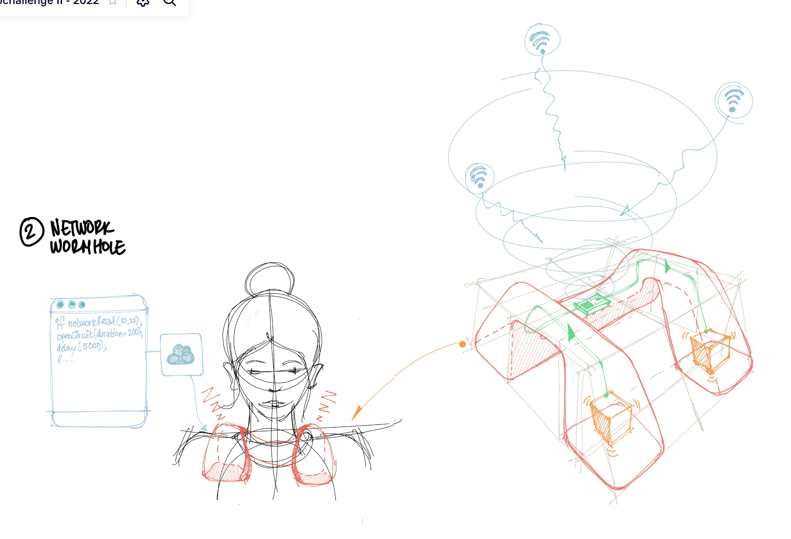

For the available time and resources, we decided to go ahead with the first concept.

## Process

### First-hand Prototyping
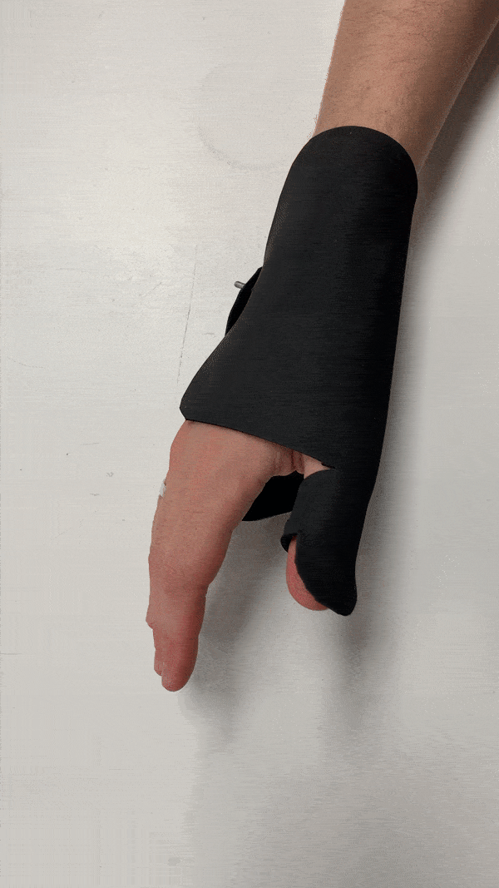 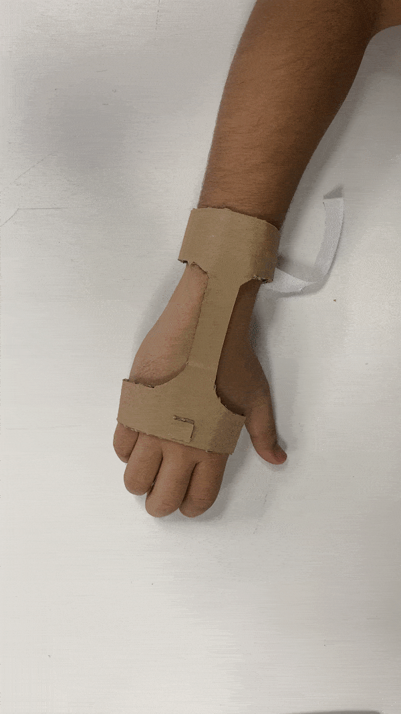 

### Fabrication
For the initial phase, certain prototypes were made using EVA rubber and cardboard to ensure measurements and proportions were correct. The next step involved creating a flat net diagram of the desired form digitally in Rhino 7. To ensure the adjustable factor of design, the design was programmed with Grasshopper to create an auxetic and meshed structure.

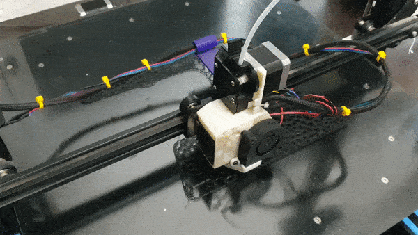  

The housing for the electronic components were printed using PLA. The components were designed in such a way that they fixed onto the wrapping structure.

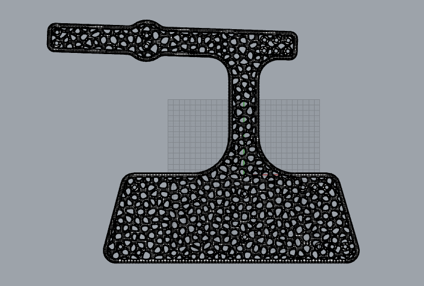 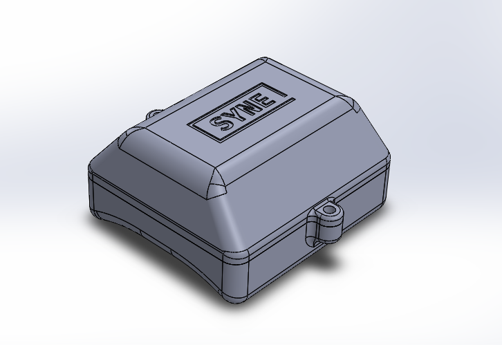 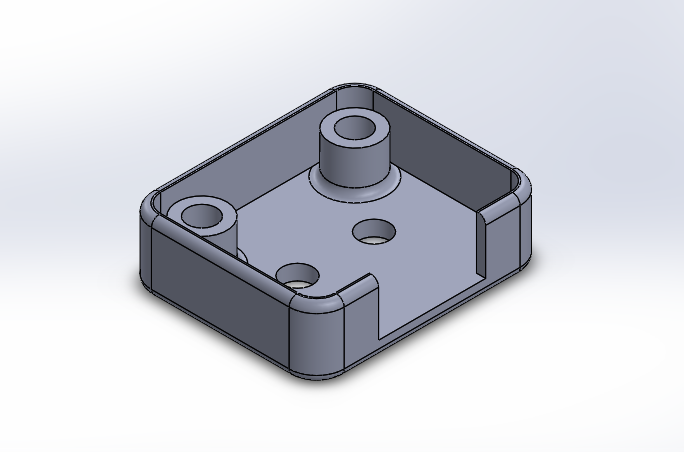

### Electronics

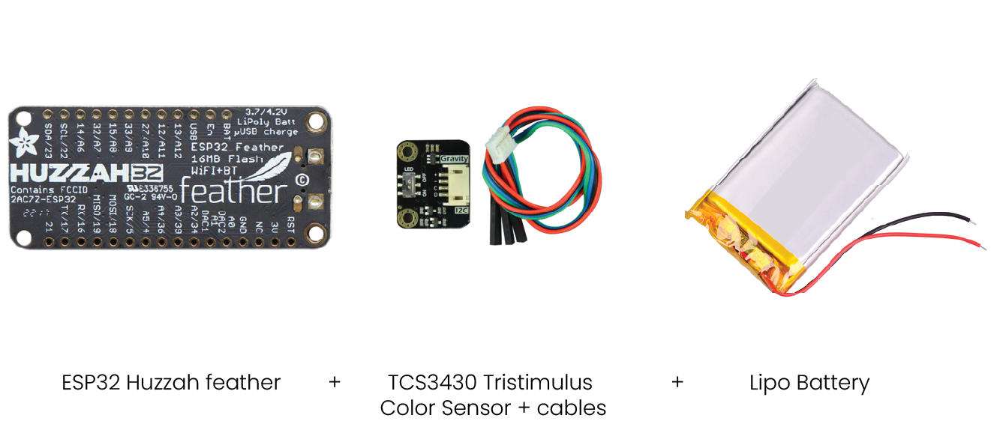

The ESP32 Feather was the microcontroller most apt of the design because of the form factor and modes of connectivity. A Tristimulus color sensor was used to get values in the XYZ color value model which is part of the similar color values family as RGB, CMYK etc. The sensor follows an I2C protocol which stands for Inter-Integrated Circuit protocol, incorporated into devices for serial communication.

### What is Serial communication?
Serial communication is a communication method that uses one or two transmission lines to send and receive data, and that data is continuously sent and received one bit at a time. This is used to communicate across devices which are made of a combination of microcontrollers etc. 

We wanted to use serial communication between esp32 and p5.js using bluetooth, for which you can follow these tutorials:

https://itp.nyu.edu/physcomp/labs/labs-serial-communication/lab-serial-input-to-the-p5-js-ide/
https://www.prometec.net/esp32-serial-bluetooth/

The values from the senor were sent to a p5.js sketch of a violin synth. The values captured from were ranged and sent using the Serial.write(output) syntax. 

For example:
int x=TCS3430.getXData();
int output = 1;

At the p5.js end data receiving and playing a specific note looks like this:

print(inData);
if(inData == '1')
  {pitch = "A4";}

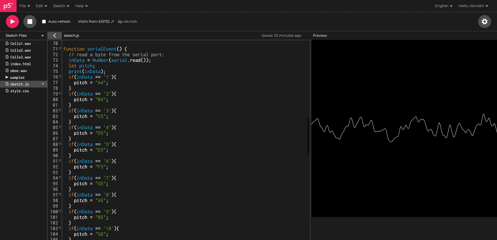

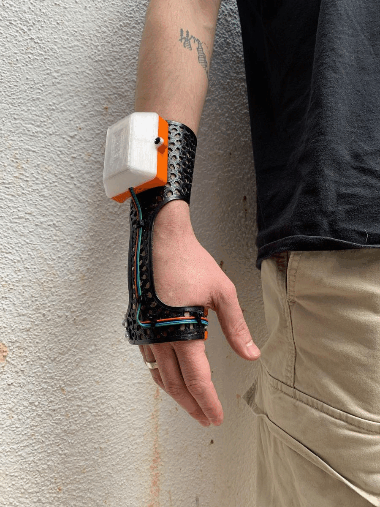

## Learnings

Exploring hybrid fabrication methods with materials like TPU, PLA and PetG.

Using generative design patterns with flexible materials .

Debugging scripts in Grasshopper.

Serial communication across platfroms and systems.

Looking for online documentation makes working with electronics easier.

A little experimentation with coding never hurt nobody.

One should always design wearables with adjustable sizing.
